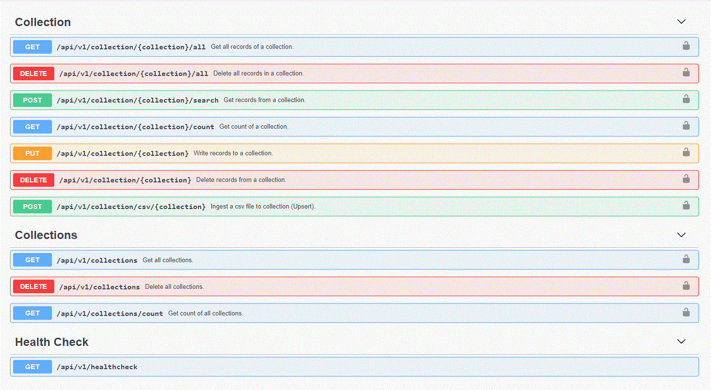

### Exposing CRUD operations for mongodb generic data collection via nodejs REST API

- Ensure that you have [node.js](https://nodejs.org/en/) installed on your computer.

- Install the dependencies

```bash
cd src
npm install
```

- Start the development server

```bash
npm run dev
```

- Explore the API from [here](http://localhost:4000/api-docs)


